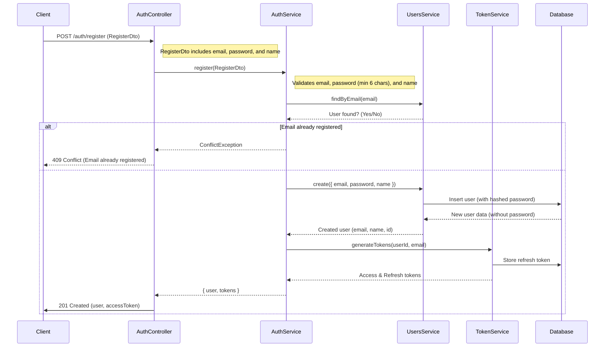
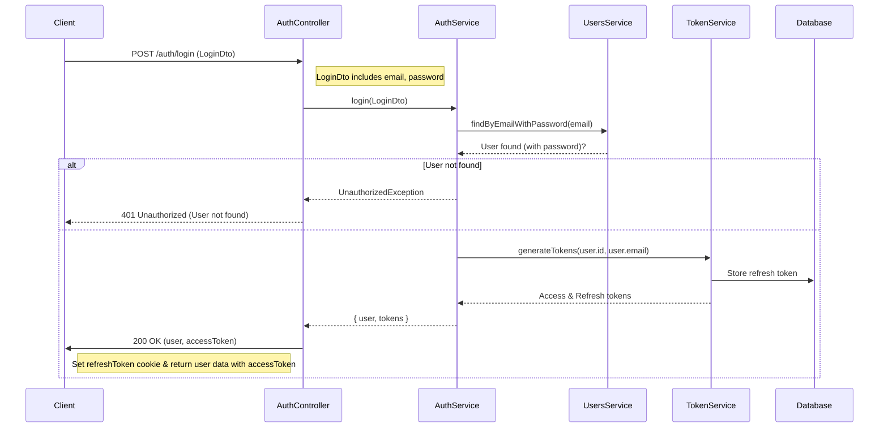
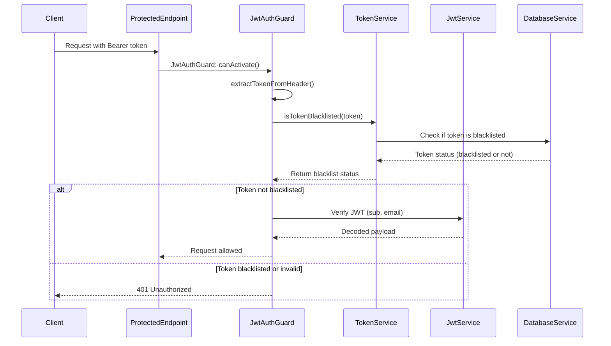
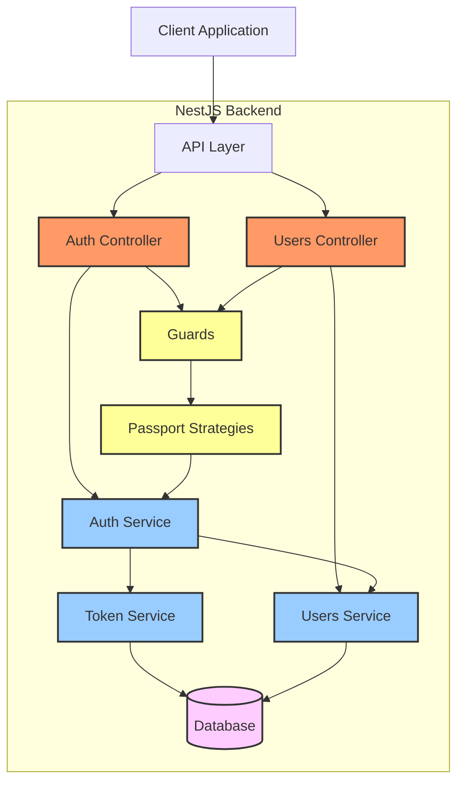

<p align="center">
  <a href="http://nestjs.com/" target="blank"></a>
</p>

[circleci-image]: https://img.shields.io/circleci/build/github/nestjs/nest/master?token=abc123def456
[circleci-url]: https://circleci.com/gh/nestjs/nest

  <p align="center">A progressive <a href="http://nodejs.org" target="_blank">Node.js</a> framework for building efficient and scalable server-side applications.</p>
    <p align="center">
<a href="https://www.npmjs.com/~nestjscore" target="_blank"></a>
<a href="https://www.npmjs.com/~nestjscore" target="_blank"></a>
<a href="https://www.npmjs.com/~nestjscore" target="_blank"></a>
<a href="https://circleci.com/gh/nestjs/nest" target="_blank"></a>
<a href="https://coveralls.io/github/nestjs/nest?branch=master" target="_blank"></a>
<a href="https://discord.gg/G7Qnnhy" target="_blank"></a>
<a href="https://opencollective.com/nest#backer" target="_blank"></a>
<a href="https://opencollective.com/nest#sponsor" target="_blank"></a>
  <a href="https://paypal.me/kamilmysliwiec" target="_blank"></a>
    <a href="https://opencollective.com/nest#sponsor"  target="_blank"></a>
  <a href="https://twitter.com/nestframework" target="_blank"></a>
</p>
  <!--[](https://opencollective.com/nest#backer)
  [](https://opencollective.com/nest#sponsor)-->

## Description

[Nest](https://github.com/nestjs/nest) framework TypeScript starter repository.

## Project setup

```bash
$ npm install
```

## Compile and run the project

```bash
# development
$ npm run start

# watch mode
$ npm run start:dev

# production mode
$ npm run start:prod
```

## Run tests

```bash
# unit tests
$ npm run test

# e2e tests
$ npm run test:e2e

# test coverage
$ npm run test:cov
```

### Register Flow:



### Diagram Explanation:

1. **Client to AuthController**: The client sends a `POST` request to `/auth/register` with the registration data (`email`, `password`, and `name`).
2. **AuthController to AuthService**: The `AuthController` calls the `register()` method in `AuthService` with the registration data.
3. **AuthService to UsersService**: The `AuthService` checks if a user with the provided email already exists using `UsersService`'s `findByEmail()` method.
4. **User already exists or not**:
   - If the user already exists, the system returns a `409 Conflict` response.
   - If the user doesn't exist, the system proceeds to create a new user.
5. **User creation**: The `AuthService` calls `UsersService`'s `create()` method to create a new user in the database, with the password being hashed before storage.
6. **Token generation**: The `AuthService` calls `TokenService` to generate an `accessToken` and `refreshToken` for the newly created user.
7. **Refresh token stored**: The refresh token is stored in the database for future use (to handle token refresh operations).
8. **Response to Client**: The `AuthController` sets the `refreshToken` in the client's cookies and returns the `user` object (excluding the password) along with the `accessToken` to the client.

### Login Flow:



### Diagram Explanation:

1. **Client to AuthController**: The client sends a `POST` request to `/auth/login` with the login credentials (`email` and `password`).
2. **AuthController to AuthService**: The `AuthController` calls the `login()` method in `AuthService` with the login data.
3. **AuthService to UsersService**: The `AuthService` checks the database using `UsersService` to find the user by email and validate the password.
4. **User found or not**:
   - If the user is not found, the system returns a `401 Unauthorized` response.
   - If the user is found, the system proceeds to generate tokens.
5. **Token generation**: The `AuthService` calls `TokenService` to generate access and refresh tokens.
6. **Tokens stored**: The refresh token is stored in the database.
7. **Response to Client**: The `AuthController` returns the user data along with the access token to the client and sets the refresh token in a cookie.

### Logout Flow:

```mermaid
sequenceDiagram
    participant Client
    participant AuthController
    participant AuthService
    participant TokenService
    participant Database

    Client->>AuthController: POST /auth/logout
    AuthController->>AuthService: Calls logout() with tokens
    AuthService->>TokenService: Revoke refresh token
    TokenService->>Database: Delete refresh token
    AuthService->>TokenService: Blacklist access token
    TokenService->>Database: Store blacklisted access token
    AuthController->>Client: Clear refresh token cookie
    AuthController->>Client: Return logout success message
  end
```

### Diagram Explanation:

1. **Client to AuthController**: The client sends a `POST` request to `/auth/logout`.
2. **AuthController to AuthService**: The `AuthController` calls the `logout()` method in `AuthService` with the tokens.
3. **Revoking Refresh Token**: The `AuthService` calls `TokenService` to revoke the refresh token.
4. **Deleting Refresh Token**: The `TokenService` deletes the refresh token from the database.
5. **Blacklisting Access Token**: The `AuthService` requests `TokenService` to blacklist the access token.
6. **Storing Blacklisted Token**: The `TokenService` stores the blacklisted token in the database.
7. **Clearing Token Cookie**: The `AuthController` clears the refresh token cookie from the client.
8. **Response to Client**: The `AuthController` returns a success message to confirm the logout process.

### Authentication Verification Flow (protected route):



### Diagram Explanation:

1. **Client to ProtectedEndpoint**: The client sends a request to a protected endpoint with a Bearer token.
2. **ProtectedEndpoint to JwtAuthGuard**: The request is intercepted by the `JwtAuthGuard`'s `canActivate()` method.
3. **Extracting Token**: The `JwtAuthGuard` extracts the token from the request header.
4. **Checking Token Status**:
   - The `JwtAuthGuard` calls `TokenService` to check if the token is blacklisted.
5. **Token Blacklisted or Not**:
   - If the token is not blacklisted, the system proceeds to verify the JWT.
   - If the token is blacklisted or invalid, the system returns a `401 Unauthorized` response.
6. **JWT Verification**:
   - The `JwtAuthGuard` calls `JwtService` to verify the JWT.
7. **Response to Client**:
   - If the token is valid, the request is allowed to proceed.
   - If the token is blacklisted or invalid, the system returns a `401 Unauthorized` response.

### Token Refresh Flow:

```mermaid
sequenceDiagram
    participant Client
    participant AuthController
    participant AuthService
    participant TokenService
    participant Database

    Client->>AuthController: POST /api/auth/refresh (with refresh_token cookie)
    AuthController->>AuthService: refreshTokens(refreshToken)
    AuthService->>TokenService: verifyRefreshToken(refreshToken)
    TokenService->>Database: refreshToken.findUnique()
    Database-->>TokenService: stored token
    TokenService->>TokenService: jwt.verify(token)
    TokenService-->>AuthService: JwtPayload
    AuthService->>TokenService: generateTokens(userId, email)
    TokenService->>Database: storeRefreshToken(newToken)
    TokenService->>TokenService: revokeRefreshToken(oldToken)
    TokenService-->>AuthService: {accessToken, refreshToken}
    AuthService-->>AuthController: {tokens}
    AuthController->>Client: Set refreshToken cookie & return {accessToken}
  end
```

### Diagram Explanation:

1. **Client to AuthController**: The client sends a `POST` request to `/api/auth/refresh` with the `refresh_token` cookie.
2. **AuthController to AuthService**: The `AuthController` calls the `refreshTokens()` method in `AuthService` with the `refreshToken`.
3. **Verifying Refresh Token**: The `AuthService` calls `TokenService` to verify the refresh token.
4. **Finding Refresh Token**:
   - The `TokenService` checks the database for the refresh token.
5. **JWT Verification**:
   - The `TokenService` verifies the refresh token using JWT.
6. **Token Generation**:
   - The `AuthService` generates new access and refresh tokens for the user.
   - The new tokens are returned to the `AuthController`.
7. **Storing New Refresh Token**:
   - The new refresh token is stored in the database.
8. **Response to Client**:

   - The `AuthController` sends the new tokens back to the client.
   - The `refreshToken` cookie is updated with the new refresh token.
   - The client receives the new `accessToken`.

### Overall System Architecture:


