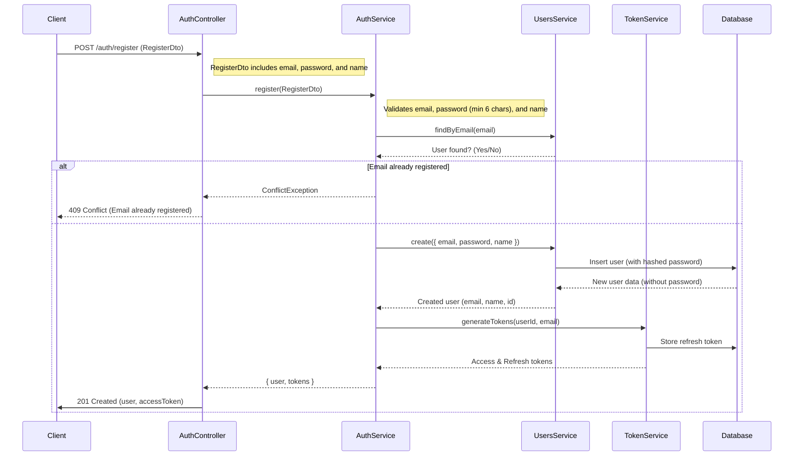
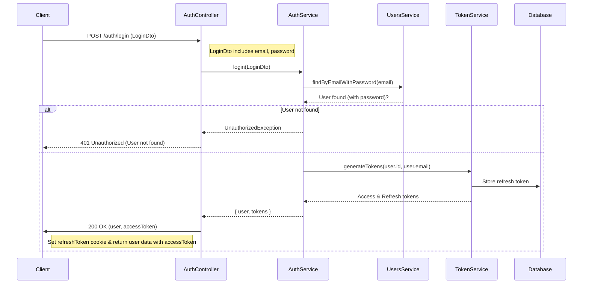
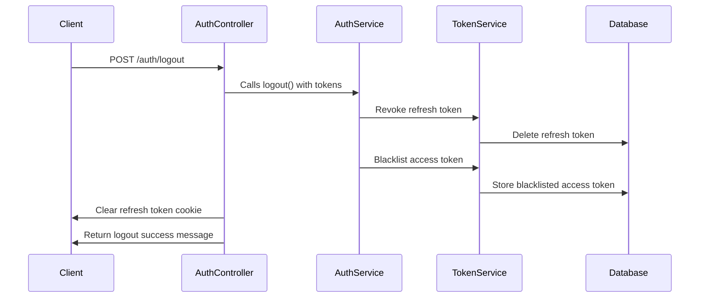
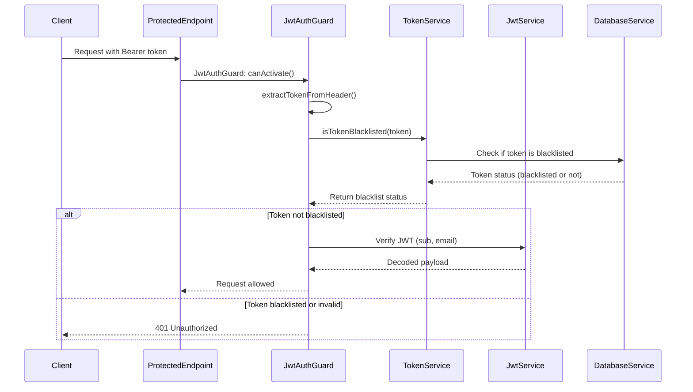
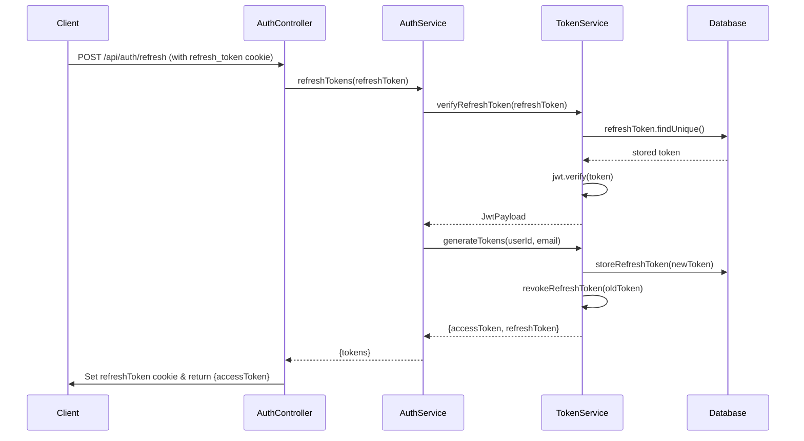
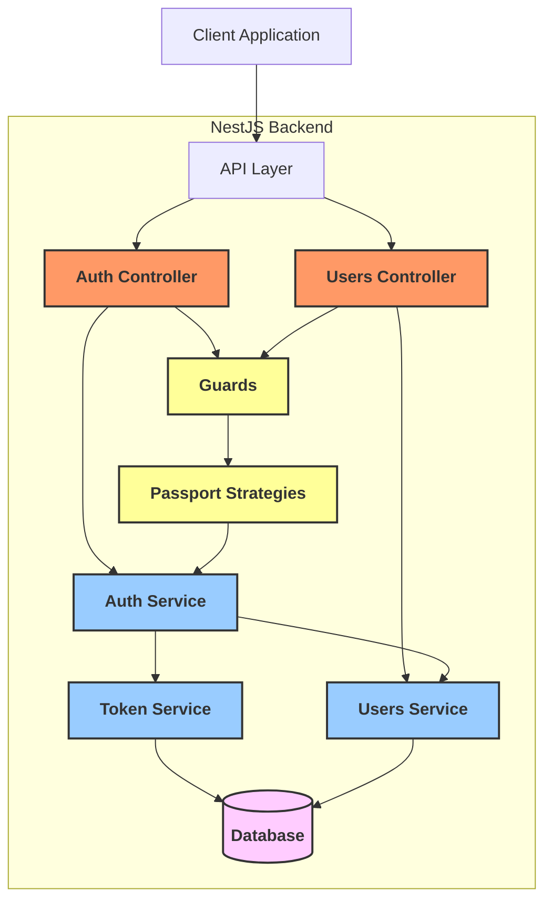

<p align="center">
  <a href="http://nestjs.com/" target="blank"></a>
</p>

[circleci-image]: https://img.shields.io/circleci/build/github/nestjs/nest/master?token=abc123def456
[circleci-url]: https://circleci.com/gh/nestjs/nest

  <p align="center">A progressive <a href="http://nodejs.org" target="_blank">Node.js</a> framework for building efficient and scalable server-side applications.</p>
    <p align="center">
<a href="https://www.npmjs.com/~nestjscore" target="_blank"></a>
<a href="https://www.npmjs.com/~nestjscore" target="_blank"></a>
<a href="https://www.npmjs.com/~nestjscore" target="_blank"></a>
<a href="https://circleci.com/gh/nestjs/nest" target="_blank"></a>
<a href="https://coveralls.io/github/nestjs/nest?branch=master" target="_blank"></a>
<a href="https://discord.gg/G7Qnnhy" target="_blank"></a>
<a href="https://opencollective.com/nest#backer" target="_blank"></a>
<a href="https://opencollective.com/nest#sponsor" target="_blank"></a>
  <a href="https://paypal.me/kamilmysliwiec" target="_blank"></a>
    <a href="https://opencollective.com/nest#sponsor"  target="_blank"></a>
  <a href="https://twitter.com/nestframework" target="_blank"></a>
</p>
  <!--[](https://opencollective.com/nest#backer)
  [](https://opencollective.com/nest#sponsor)-->

## Description

Sunnsteel Backend - A fitness API built with NestJS featuring workout tracking, routines management, and intelligent exercise progression systems.

## Features

### Exercise Progression Schemes

- **NONE**: No progression applied (default option)
- **DOUBLE_PROGRESSION**: Progresión cuando TODOS los sets alcanzan el objetivo de reps
  - Si todos los sets de un ejercicio logran >= reps objetivo, se aumenta el peso en todos los sets
- **DYNAMIC_DOUBLE_PROGRESSION**: Progresión individual por set
  - Cada set progresa independientemente cuando alcanza el objetivo de reps target
- **PROGRAMMED_RTF (Last set Reps to Failure)**: Programa con duración fija (18/21 semanas) y avance por calendario
  - 5 sets por ocurrencia (4 fijos + 1 AMRAP con objetivo)
  - Intensidad semanal como % del TM (1RM proxy)
  - Semanas de deload opcionales (7/14/21) con 3×5 @ RPE6 y TM congelado
  - Inicio/fin programados por fecha; días programados por semana (ej. Lun/Vie)
  - El TM se ajusta 1 vez por semana por ejercicio usando el desempeño del set AMRAP (regla pieza a pieza)
- Configurable minimum weight increment per exercise (default: 2.5kg)
- Automatic progression calculation on session completion
- Support for both fixed reps and rep ranges (min/max)

### Authentication & Security

- JWT-based authentication with access and refresh tokens
- Secure password hashing with bcrypt
- Token blacklisting for logout functionality
- Rate limiting for security
- Google Sign-In via ID token (POST `/api/auth/google`)
  - Frontend obtains a Google ID token via Google Identity Services and posts it to `/api/auth/google`.
  - On success, backend returns `accessToken` in the JSON response and sets the refresh cookie.

#### Guards per Module

- Users, Routines, Workouts: protected by `SupabaseJwtGuard` (expect Supabase access token in `Authorization: Bearer <token>`)
- Exercises: protected by `SupabaseJwtGuard` as well (aligned with frontend Supabase session)
- Legacy endpoints using `JwtAuthGuard` remain compatible where explicitly noted.

#### Cookies & Session Signals

- Refresh token cookie: `refresh_token`
  - `httpOnly: true`, `sameSite: 'strict'`, `secure: NODE_ENV === 'production'`, `maxAge: 7d`.
- Session presence cookie: `has_session`
  - `httpOnly: false` (non-HttpOnly), mirrors the refresh cookie lifetime and flags, used by the frontend middleware to safely redirect authenticated users away from `/login` and `/signup` without loops from stale cookies.
  - Set on register/login/google/refresh; cleared on logout.

#### JWT Secrets

- Access token signing: `JWT_ACCESS_SECRET`
- Refresh token signing: `JWT_REFRESH_SECRET`

#### Refresh Token Storage & Rotation

- Refresh tokens are stored in the database per user; on refresh the token is rotated and the new one is persisted.
- Each refresh token carries a `jti` (unique ID) to avoid collisions; a rare race on insert is safely handled server-side.

#### CORS

- CORS is enabled with credentials and a configurable origin (defaults to `http://localhost:3000`).

### Workout Management

- Workout session tracking (start, finish, abort)
- Set logging with reps, weight, RPE
- Session history with filtering and pagination
- Progression calculations applied automatically on session completion
  - Para **PROGRAMMED_RTF**: validaciones de calendario en inicio, prescripción semanal en la respuesta, ajuste de TM al finalizar (si no es deload) y bloqueo cuando el programa termina

### Routines Management

- Create and manage workout routines
- Multi-day routine support
- Exercise configuration per routine day
- Favorites and completion tracking

## Installation

```bash
$ npm install
```

### Google Sign-In (ID token)

- Endpoint: `POST /api/auth/google`
- Body: `{ "idToken": string }` where `idToken` is obtained from Google Identity Services (GIS) on the frontend.
- Behavior:
  - Verifies the Google ID token server-side against `GOOGLE_CLIENT_ID`.
  - If the email is verified and the user does not exist, it creates the user.
  - Issues the standard access token in the response and sets the refresh token in an HTTP-only cookie (same as login/register).

Example request:

```http
POST /api/auth/google
Content-Type: application/json

{ "idToken": "<google-id-token>" }
```

Response:

```json
{ "user": { "id": "...", "email": "...", "name": "..." }, "accessToken": "..." }
```

## Running the app

```bash
# development
$ npm run start

# watch mode
$ npm run start:dev

# production mode
$ npm run start:prod
```

## Testing

### Test Architecture

- **Unit Tests**: Jest-based tests for services, controllers, and utilities
- **E2E Tests**: Integration tests for complete API endpoints
- **Coverage**: Istanbul/Jest coverage reporting
- **CI/CD**: Automated testing on GitHub Actions with PostgreSQL

### Running Tests

```bash
# unit tests
$ npm run test

# unit tests in watch mode
$ npm run test:watch

# e2e tests
$ npm run test:e2e

# test coverage
$ npm run test:cov
```

### Test Coverage

Current test modules:

- **Auth Module**: AuthController, AuthService with login/register/logout/refresh
- **Users Module**: UsersController, UsersService with profile management
- **Exercises Module**: ExercisesController, ExercisesService with exercise catalog
- **Token Module**: TokenService with JWT and refresh token management
- **Routines Module**: RoutinesService with CRUD and progression features
- **Workouts Module**: WorkoutsService, WorkoutsController with session management

### CI/CD Pipeline

GitHub Actions workflow includes:

- PostgreSQL database setup
- Prisma migrations and seeding
- Unit and E2E test execution
- Build verification
- Environment variable validation

### Test Maintenance

⚠️ **Important**: When making code changes, always:

1. Update existing tests if functionality changes
2. Add new tests for new features or bug fixes
3. Verify all tests pass before committing
4. Update test documentation if test structure changes

### Register Flow:



### Diagram Explanation:

1. **Client to AuthController**: The client sends a `POST` request to `/auth/register` with the registration data (`email`, `password`, and `name`).
2. **AuthController to AuthService**: The `AuthController` calls the `register()` method in `AuthService` with the registration data.
3. **AuthService to UsersService**: The `AuthService` checks if a user with the provided email already exists using `UsersService`'s `findByEmail()` method.
4. **User already exists or not**:
   - If the user already exists, the system returns a `409 Conflict` response.
   - If the user doesn't exist, the system proceeds to create a new user.
5. **User creation**: The `AuthService` calls `UsersService`'s `create()` method to create a new user in the database, with the password being hashed before storage.
6. **Token generation**: The `AuthService` calls `TokenService` to generate an `accessToken` and `refreshToken` for the newly created user.
7. **Refresh token stored**: The refresh token is stored in the database for future use (to handle token refresh operations).
8. **Response to Client**: The `AuthController` sets the `refreshToken` in the client's cookies and returns the `user` object (excluding the password) along with the `accessToken` to the client.

### Login Flow:



### Diagram Explanation:

1. **Client to AuthController**: The client sends a `POST` request to `/auth/login` with the login credentials (`email` and `password`).
2. **AuthController to AuthService**: The `AuthController` calls the `login()` method in `AuthService` with the login data.
3. **AuthService to UsersService**: The `AuthService` checks the database using `UsersService` to find the user by email and validate the password.
4. **User found or not**:
   - If the user is not found, the system returns a `401 Unauthorized` response.
   - If the user is found, the system proceeds to generate tokens.
5. **Token generation**: The `AuthService` calls `TokenService` to generate access and refresh tokens.
6. **Tokens stored**: The refresh token is stored in the database.
7. **Response to Client**: The `AuthController` returns the user data along with the access token to the client and sets the refresh token in a cookie.

### Logout Flow:



### Diagram Explanation:

1. **Client to AuthController**: The client sends a `POST` request to `/auth/logout`.
2. **AuthController to AuthService**: The `AuthController` calls the `logout()` method in `AuthService` with the tokens.
3. **Revoking Refresh Token**: The `AuthService` calls `TokenService` to revoke the refresh token.
4. **Deleting Refresh Token**: The `TokenService` deletes the refresh token from the database.
5. **Blacklisting Access Token**: The `AuthService` requests `TokenService` to blacklist the access token.
6. **Storing Blacklisted Token**: The `TokenService` stores the blacklisted token in the database.
7. **Clearing Token Cookie**: The `AuthController` clears the refresh token cookie from the client.
8. **Response to Client**: The `AuthController` returns a success message to confirm the logout process.

### Authentication Verification Flow (protected route):



### Diagram Explanation:

1. **Client to ProtectedEndpoint**: The client sends a request to a protected endpoint with a Bearer token.
2. **ProtectedEndpoint to JwtAuthGuard**: The request is intercepted by the `JwtAuthGuard`'s `canActivate()` method.
3. **Extracting Token**: The `JwtAuthGuard` extracts the token from the request header.
4. **Checking Token Status**:
   - The `JwtAuthGuard` calls `TokenService` to check if the token is blacklisted.
5. **Token Blacklisted or Not**:
   - If the token is not blacklisted, the system proceeds to verify the JWT.
   - If the token is blacklisted or invalid, the system returns a `401 Unauthorized` response.
6. **JWT Verification**:
   - The `JwtAuthGuard` calls `JwtService` to verify the JWT.
7. **Response to Client**:
   - If the token is valid, the request is allowed to proceed.
   - If the token is blacklisted or invalid, the system returns a `401 Unauthorized` response.

### Token Refresh Flow:



## Routine Structure & Rep Prescription

Routines contain days, each with exercises and their prescribed sets. Sets now support two rep prescription modes via `repType`:

- `FIXED`: requires `reps`
- `RANGE`: requires `minReps` and `maxReps` (with `minReps <= maxReps`)

Relevant Prisma models:

```prisma
model RoutineExercise {
  id           String               @id @default(uuid())
  routineDayId String
  routineDay   RoutineDay           @relation(fields: [routineDayId], references: [id], onDelete: Cascade)
  exerciseId   String
  exercise     Exercise             @relation(fields: [exerciseId], references: [id])
  order        Int                  @default(0)
  restSeconds  Int                  @default(60)
  // Progression configuration per exercise
  progressionScheme  ProgressionScheme @default(NONE)
  minWeightIncrement Float             @default(2.5)
  // PROGRAMMED_RTF specific
  programTMKg             Float?
  programRoundingKg       Float         @default(2.5)
  programLastAdjustedWeek Int?
  sets         RoutineExerciseSet[]
}

model RoutineExerciseSet {
  id                String          @id @default(uuid())
  routineExerciseId String
  routineExercise   RoutineExercise @relation(fields: [routineExerciseId], references: [id], onDelete: Cascade)
  setNumber         Int
  repType           RepType         @default(FIXED)
  reps              Int?
  minReps           Int?
  maxReps           Int?
  weight            Float?

  @@unique([routineExerciseId, setNumber])
}

enum RepType {
  FIXED
  RANGE
}

enum ProgressionScheme {
  NONE
  DOUBLE_PROGRESSION
  DYNAMIC_DOUBLE_PROGRESSION
  PROGRAMMED_RTF
}
```

### API Response Shape

Selectors for routines endpoints include set fields: `setNumber`, `repType`, `reps`, `minReps`, `maxReps`, `weight`.
Cuando `progressionScheme = PROGRAMMED_RTF`, además existen campos por ejercicio: `programTMKg`, `programRoundingKg`.

### Validation

- When creating/updating sets:
  - `FIXED` → `reps` required
  - `RANGE` → `minReps` and `maxReps` required and `minReps <= maxReps`

### Notes

- Ensure Prisma client is regenerated after schema changes:
  - `npx prisma generate`
  - then `npm run build`

## PROGRAMMED_RTF (RtF) — Date-Driven Program

### Rutina programada (campos Routine)

- `programWithDeloads: boolean` (true = 21 semanas con deload; false = 18 sin deload)
- `programDurationWeeks: 18 | 21`
- `programStartWeek?: number` (solo creación; default 1; clamp 1..(18|21))
- `programStartDate: Date` (columna DATE; día calendario)
- `programEndDate: Date` (columna DATE; calculado)
- `programTrainingDaysOfWeek: int[]` (0=Sun .. 6=Sat; ordenado; el primero es el “día inicial”)
- `programTimezone: string` (IANA, ej. "America/Argentina/Buenos_Aires")

Reglas:

- La fecha de inicio debe coincidir con el weekday del primer día de entrenamiento configurado.
- El programa avanza por calendario (zona horaria de la rutina). No depende de sesiones realizadas.
- Al finalizar (fecha > `programEndDate`), se bloquea el inicio de nuevas sesiones.
- Si la rutina comienza en una semana N (`programStartWeek`), la `programEndDate` se calcula usando las semanas restantes desde N.

### Inicio de sesión (POST /api/workouts/sessions/start)

- Valida: hoy ≥ `programStartDate`, hoy ≤ `programEndDate`, hoy corresponde a un día programado y `routineDay.dayOfWeek` coincide con hoy.
- Respuesta incluye la prescripción del día para cada ejercicio `PROGRAMMED_RTF`:
  - Semana de entrenamiento: `weightKg` (TM × intensidad % redondeado), `fixedReps` (sets 1–4), `amrapTarget` (set 5)
  - Semana de deload: 3×5 @ RPE6 con `weightKg = round(TM × 0.60, rounding)`

### Fin de sesión (PATCH /api/workouts/sessions/:id/finish)

- Semana de deload: no ajusta TM.
- Semana de entrenamiento: por cada ejercicio `PROGRAMMED_RTF`, si existe el log del set 5 (AMRAP) y aún no se ajustó en esa semana (`programLastAdjustedWeek`), ajustar TM con la regla pieza a pieza; guardar `programLastAdjustedWeek`.

### Program Style (`programStyle`)

The routine-level field `programStyle` refines the semantics of a
`PROGRAMMED_RTF` program without introducing a separate progression scheme
enum value. It is optional and persisted as:

```
enum ProgramStyle {
  STANDARD
  HYPERTROPHY
}
```

#### Purpose

`programStyle` allows multiple presentation / analytic variants of the same
underlying PROGRAMMED_RTF engine without schema churn or legacy enum bloat.
Currently both styles share identical progression mechanics; differentiation is
UI + future analytics (volume focus, rep band targeting, TM heuristic tuning).

#### Persistence Rules

| Scenario | Stored Value |
|----------|--------------|
| Routine has at least one PROGRAMMED_RTF exercise & style provided | Provided style |
| Routine has PROGRAMMED_RTF but style omitted | `NULL` (treated as STANDARD on read) |
| Routine has no PROGRAMMED_RTF exercises | `NULL` |
| Update removes all PROGRAMMED_RTF exercises | Field cleared to `NULL` |

#### API Behavior

- Create / Update DTO accepts: `programStyle?: 'STANDARD' | 'HYPERTROPHY'`.
- Validation rejects any other string.
- Service layer only writes `programStyle` when at least one exercise in the
  payload uses `PROGRAMMED_RTF`.
- Select clauses include `programStyle`; clients should coerce `null` →
  `'STANDARD'` for display if they want a non-null label.

#### Backward Compatibility

Existing routines created before the field was introduced will have `NULL`.
They are functionally equivalent to STANDARD. No migration backfill required.

#### Future Differentiation (Roadmap)

| Future Aspect | STANDARD (Baseline) | HYPERTROPHY (Planned) |
|---------------|---------------------|------------------------|
| Rep Emphasis | Strength-endurance mix | Higher average reps (8–12 focus) |
| TM Increment Ladder | Current ladder | Possibly slower / volume-gated |
| Volume Ramp | Flat 5-set structure | Optional ramp + mini deload pattern |
| Analytics | Generic TM trend | Additional rep band compliance metrics |

#### Client Guidance

1. Treat missing style as STANDARD when rendering.
2. Badge a hypertrophy routine distinctly (color / label) for quick scanning.
3. When future per-exercise style overrides ship, routine-level `programStyle`
   becomes the default style (exercise-level value can override).

#### Example Create Payload (with programStyle)

```json
{
  "name": "Lower/Upper Split RtF",
  "isPeriodized": false,
  "programWithDeloads": true,
  "programStartDate": "2025-09-22",
  "programTimezone": "UTC",
  "programStyle": "HYPERTROPHY",
  "days": [
    {
      "dayOfWeek": 1,
      "order": 0,
      "exercises": [
        {
          "exerciseId": "squat-id",
          "restSeconds": 180,
          "progressionScheme": "PROGRAMMED_RTF",
          "programTMKg": 150,
          "programRoundingKg": 2.5,
          "sets": [ { "setNumber": 1, "repType": "FIXED", "reps": 5 }, { "setNumber": 2, "repType": "FIXED", "reps": 5 }, { "setNumber": 3, "repType": "FIXED", "reps": 5 }, { "setNumber": 4, "repType": "FIXED", "reps": 5 }, { "setNumber": 5, "repType": "FIXED", "reps": 1 } ]
        }
      ]
    }
  ]
}
```

#### Reading the Field

```ts
function displayStyle(raw: 'STANDARD' | 'HYPERTROPHY' | null | undefined) {
  return raw ?? 'STANDARD'
}
```

#### Testing Considerations

- Unit tests should verify create & update pathways pass the provided style.
- Null style routines must still compile & serialize without throwing.
- Adding future style-specific logic should include regression tests that
  confirm STANDARD behavior remains unchanged.

---

Behavioral notes (current phase):

- Storage only (no server-side algorithm divergence yet).
- Frontend uses the value to select an alternate presentation / future volume
  heuristic.
- If a routine has no `PROGRAMMED_RTF` exercises the field is forced to `null`.
- When updating a routine: removing all `PROGRAMMED_RTF` exercises nullifies
  the field; adding at least one enables (and may set from payload).

Validation / API rules:

| Case | Server Behavior |
|------|-----------------|
| Create with PROGRAMMED_RTF exercises & style provided | Persist style if `STANDARD|HYPERTROPHY` |
| Create with PROGRAMMED_RTF exercises & no style | Persist `null` (frontend treats as STANDARD) |
| Update adds first PROGRAMMED_RTF exercise & style provided | Persist style |
| Update removes all PROGRAMMED_RTF exercises | Set `programStyle = null` |
| Update supplies invalid style | 400 Bad Request |

Client fallback rule: treat `null` as `STANDARD` for rendering badges and
program summaries.

Planned extensions (see backend `IMPROVEMENTS.md` Section 4 / 11):

- TM adjustment event logging will snapshot `programStyle` per adjustment row.
- Divergent hypertrophy progression heuristics (rep band & auto weight cues).
- Per-exercise style overrides (mixed STANDARD / HYPERTROPHY) (future).

Rollback safety: Field is nullable, read logic always guards; removing all UI
references leaves existing rows harmless.

### Regeneración del cliente Prisma

Tras aplicar los cambios en Prisma:

```bash
npx prisma generate
npm run build
```

### Diagram Explanation:

1. **Client to AuthController**: The client sends a `POST` request to `/api/auth/refresh` with the `refresh_token` cookie.
2. **AuthController to AuthService**: The `AuthController` calls the `refreshTokens()` method in `AuthService` with the `refreshToken`.
3. **Verifying Refresh Token**: The `AuthService` calls `TokenService` to verify the refresh token.
4. **Finding Refresh Token**:
   - The `TokenService` checks the database for the refresh token.
5. **JWT Verification**:
   - The `TokenService` verifies the refresh token using JWT.
6. **Token Generation**:
   - The `AuthService` generates new access and refresh tokens for the user.
   - The new tokens are returned to the `AuthController`.
7. **Storing New Refresh Token**:
   - The new refresh token is stored in the database.
8. **Response to Client**:

   - The `AuthController` sends the new tokens back to the client.
   - The `refreshToken` cookie is updated with the new refresh token.
   - The client receives the new `accessToken`.

### Overall System Architecture:



# Routines - Favorites & Completed

The Routines module supports marking routines as favorites and completed per user, and allows filtering by these flags.

## Endpoints

- GET `/api/routines` — List user's routines (supports query filters)
  - Query params: `isFavorite=true|false`, `isCompleted=true|false`
- GET `/api/routines/favorites` — List user's favorite routines
- GET `/api/routines/completed` — List user's completed routines
- GET `/api/routines/:id` — Get a routine by id
- POST `/api/routines` — Create routine
- PATCH `/api/routines/:id` — Update routine (full replace of days/exercises/sets)
- PATCH `/api/routines/:id/favorite` — Toggle favorite status
- PATCH `/api/routines/:id/completed` — Toggle completed status

Request body for favorite toggle:

```json
{ "isFavorite": true }
```

Request body for completed toggle:

```json
{ "isCompleted": true }
```

## Prisma Schema

Model `Routine` includes boolean flags with default false:

```prisma
model Routine {
  id           String       @id @default(uuid())
  userId       String
  user         User         @relation(fields: [userId], references: [id], onDelete: Cascade)
  name         String
  description  String?
  isPeriodized Boolean      @default(false)
  isFavorite   Boolean      @default(false)
  isCompleted  Boolean      @default(false)
  createdAt    DateTime     @default(now())
  updatedAt    DateTime     @updatedAt
  days         RoutineDay[]

  @@index([userId, isFavorite])
  @@index([userId, isCompleted])
}
```

# Workouts - Session Tracking

The Workouts module enables tracking workout sessions tied to routine days and logging individual set performance.

## Endpoints

- POST `/api/workouts/sessions/start` — Start a new workout session for a routine day
  - Body: `{ routineId: string, routineDayId: string, notes?: string }`
- PATCH `/api/workouts/sessions/:id/finish` — Finish an in-progress session
  - Body: `{ status: "COMPLETED" | "ABORTED", notes?: string }`
  - GET `/api/workouts/sessions/active` — Get the current in-progress session (if any)
  - GET `/api/workouts/sessions` — List workout sessions (history) with filtering, sorting and cursor pagination
  - Query params (all optional):
    - `status`: `IN_PROGRESS | COMPLETED | ABORTED`
    - `routineId`: string (UUID)
    - `from`: ISO date (YYYY-MM-DD)
    - `to`: ISO date (YYYY-MM-DD)
    - `q`: free text search over notes
    - `cursor`: pagination cursor (UUID)
    - `limit`: page size (default 20, min 1, max 50)
    - `sort`: `finishedAt:desc|finishedAt:asc|startedAt:desc|startedAt:asc`
  - Validation & coercion (ListSessionsDto):
    - `status` validated as enum `WorkoutSessionStatus`
    - `routineId`, `cursor` validated as UUID
    - `from`, `to` validated as ISO8601 dates
    - `limit` coerced to number via `class-transformer` and validated as int `1..50`
    - `sort` validated against allowed values only
  - GET `/api/workouts/sessions/:id` — Get a session by id, including set logs
  - PUT `/api/workouts/sessions/:id/set-logs` — Upsert a set log during a session
  - Body: `{ routineExerciseId: string, exerciseId: string, setNumber: number, reps?: number, weight?: number, rpe?: number, isCompleted?: boolean }`
- DELETE `/api/workouts/sessions/:id/set-logs/:routineExerciseId/:setNumber` — Delete a set log during a session

All endpoints are protected with JWT.

## Prisma Schema (summary)

```prisma
enum WorkoutSessionStatus {
  IN_PROGRESS
  COMPLETED
  ABORTED
}

model WorkoutSession {
  id           String               @id @default(uuid())
  userId       String
  user         User                 @relation(fields: [userId], references: [id], onDelete: Cascade)
  routineId    String
  routine      Routine              @relation(fields: [routineId], references: [id], onDelete: Cascade)
  routineDayId String
  routineDay   RoutineDay           @relation(fields: [routineDayId], references: [id], onDelete: Cascade)
  status       WorkoutSessionStatus @default(IN_PROGRESS)
  startedAt    DateTime             @default(now())
  endedAt      DateTime?
  durationSec  Int?
  notes        String?
  setLogs      SetLog[]

  createdAt    DateTime             @default(now())
  updatedAt    DateTime             @updatedAt

  @@index([userId, status, startedAt])
}

model SetLog {
  id                String          @id @default(uuid())
  sessionId         String
  session           WorkoutSession  @relation(fields: [sessionId], references: [id], onDelete: Cascade)
  routineExerciseId String
  routineExercise   RoutineExercise @relation(fields: [routineExerciseId], references: [id])
  exerciseId        String
  exercise          Exercise        @relation(fields: [exerciseId], references: [id])
  setNumber         Int
  reps              Int?
  weight            Float?
  rpe               Float?
  isCompleted       Boolean         @default(false)
  completedAt       DateTime?

  createdAt         DateTime        @default(now())
  updatedAt         DateTime        @updatedAt

  @@unique([sessionId, routineExerciseId, setNumber])
  @@index([sessionId])
}
```

# Sunnsteel Workspace

Este es el workspace completo para Sunnsteel, una aplicación de fitness y entrenamiento con backend y frontend separados.

## 🏗️ Estructura del Proyecto

```
sunnsteel/
├── backend/                    # API NestJS + PostgreSQL
│   ├── .cursor/rules/         # Reglas de desarrollo backend
│   ├── scripts/               # Scripts de documentación
│   └── src/                   # Código fuente backend
├── frontend/                   # App Next.js + React
│   ├── .cursor/rules/         # Reglas de desarrollo frontend
│   ├── scripts/               # Scripts de documentación
│   └── app/                   # Código fuente frontend
└── scripts/                    # Scripts del workspace
```

## 🚀 Inicio Rápido

### Backend

```bash
cd backend
npm install
npm run start:dev
```

### Frontend

```bash
cd frontend
npm install
npm run dev
```

### Ambos Proyectos

```bash
# En el frontend
npm run dev:all
```

## 📚 Sistema de Documentación Automática

### ¿Por qué este sistema?

Para evitar la tediosa tarea de mantener manualmente la documentación actualizada, hemos implementado un sistema automático que:

1. **Detecta cambios** en la estructura del proyecto
2. **Recuerda actualizar** la documentación
3. **Mantiene consistencia** entre código y docs
4. **Mejora la productividad** del desarrollo

### Archivos de Reglas

#### Cursor

#### Backend (`.cursor/rules/`)

- **`backenddev.mdc`**: Mejora mi capacidad de desarrollo backend
- **`sunnsteel-backend.mdc`**: Contexto específico del proyecto backend
- **`auto-documentation.mdc`**: Reglas para mantener documentación actualizada

#### Frontend (`.cursor/rules/`)

- **`frontenddev.mdc`**: Mejora mi capacidad de desarrollo frontend
- **`sunnsteel-project.mdc`**: Contexto específico del proyecto frontend
- **`auto-documentation.mdc`**: Reglas para mantener documentación actualizada

#### Windsurf

#### Backend (`.windsurf/rules/`)

- **`backenddev.mdc`**: Mejora mi capacidad de desarrollo backend
- **`sunnsteel-backend.mdc`**: Contexto específico del proyecto backend
- **`auto-documentation.mdc`**: Reglas para mantener documentación actualizada

#### Frontend (`.windsurf/rules/`)

- **`frontenddev.mdc`**: Mejora mi capacidad de desarrollo frontend
- **`sunnsteel-project-part-1.mdc`**: Contexto específico del proyecto frontend
- **`sunnsteel-project-part-2.mdc`**: Contexto específico del proyecto frontend
- **`auto-documentation.mdc`**: Reglas para mantener documentación actualizada

### Scripts de Documentación

#### Individual (por proyecto)

```bash
# Backend
cd backend
npm run docs:check

# Frontend
cd frontend
npm run docs:check
```

#### Workspace (ambos proyectos)

```bash
# Desde el root del workspace
./scripts/update-all-docs.sh
```

### ¿Qué detectan los scripts?

#### Backend

- ✅ Nuevos endpoints en controllers
- ✅ Nuevos módulos en `src/`
- ✅ Cambios en esquema de Prisma
- ✅ Nuevos DTOs y guards
- ✅ Cambios en `package.json`

#### Frontend

- ✅ Nuevas páginas en `app/`
- ✅ Nuevos componentes en `components/`
- ✅ Nuevos hooks en `hooks/`
- ✅ Nuevos servicios en `lib/api/`
- ✅ Nuevos schemas de validación
- ✅ Cambios en `package.json`

## 🔧 Uso del Sistema

### 1. Desarrollo Normal

- Trabaja normalmente en tu código
- Los archivos de reglas te dan contexto automático

### 2. Después de Cambios Significativos

```bash
# Verificar qué necesita documentación
npm run docs:check

# O para todo el workspace
./scripts/update-all-docs.sh
```

### 3. Actualizar Documentación

- Basándote en los cambios detectados
- Actualiza los archivos de reglas correspondientes
- Actualiza README.md si es necesario

## 📋 Archivos a Mantener

### Backend

- `backend/.cursor/rules/backenddev.mdc`
- `backend/.cursor/rules/sunnsteel-backend.mdc`
- `backend/.cursor/rules/auto-documentation.mdc`
- `backend/README.md`

### Frontend

- `frontend/.cursor/rules/frontenddev.mdc`
- `frontend/.cursor/rules/sunnsteel-project.mdc`
- `frontend/.cursor/rules/auto-documentation.mdc`
- `frontend/README.md`

## 🎯 Beneficios

### Para el Desarrollador

- ✅ **Contexto automático** en cada proyecto
- ✅ **Detección automática** de cambios
- ✅ **Recordatorios** para actualizar documentación
- ✅ **Consistencia** entre código y docs

### Para el Proyecto

- ✅ **Documentación siempre actualizada**
- ✅ **Patrones consistentes**
- ✅ **Onboarding más fácil** para nuevos desarrolladores
- ✅ **Mantenimiento simplificado**

## 🚨 Recordatorio Importante

**La documentación desactualizada es peor que la falta de documentación.**

- Ejecuta `npm run docs:check` después de cambios significativos
- Mantén los archivos de reglas actualizados
- Actualiza README.md cuando cambie la estructura del proyecto

## 🔗 Enlaces Útiles

- [Backend README](./backend/README.md)
- [Frontend README](./frontend/README.md)
- [Documentación de NestJS](https://nestjs.com/)
- [Documentación de Next.js](https://nextjs.org/docs)

---

**¡Mantén la documentación actualizada y el desarrollo será mucho más eficiente!** 🚀
