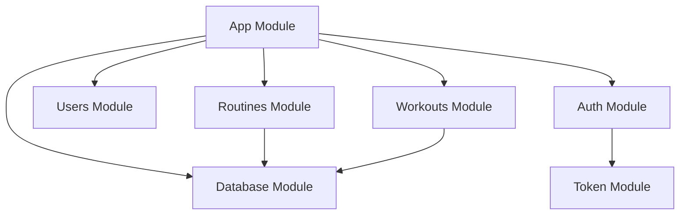

# Module Documentation

Detailed documentation for each NestJS module in the Sunnsteel Backend, including services, controllers, and business logic.

## 📋 Module Index

### **Core Modules**
- **[App Module](APP_MODULE.md)** - Application bootstrap and configuration
- **[Database Module](DATABASE_MODULE.md)** - Prisma configuration and connection
- **[Cache Module](CACHE_MODULE.md)** - Redis and in-memory caching

### **Authentication & Users**
- **[Auth Module](AUTH_MODULE.md)** - Authentication services and strategies
- **[Token Module](TOKEN_MODULE.md)** - JWT token management
- **[Users Module](USERS_MODULE.md)** - User profile management

### **Core Features**
- **[Exercises Module](EXERCISES_MODULE.md)** - Exercise catalog management
- **[Routines Module](ROUTINES_MODULE.md)** - Routine creation and management
- **[Workouts Module](WORKOUTS_MODULE.md)** - Workout session tracking

### **System Modules**
- **[Metrics Module](METRICS_MODULE.md)** - Prometheus monitoring
- **[Common Module](COMMON_MODULE.md)** - Shared utilities and interceptors

## 🏗️ Module Architecture

Each module follows NestJS best practices:

```
ModuleName/
├── module-name.module.ts      # Module definition
├── module-name.controller.ts  # HTTP endpoints
├── module-name.service.ts     # Business logic
├── dto/                       # Data transfer objects
├── guards/                    # Route guards
├── strategies/                # Auth strategies
└── types/                     # TypeScript types
```

## 🔄 Module Dependencies



## 📚 Module Guidelines

### **Service Layer**
- Business logic implementation
- Database operations via Prisma
- Error handling and validation

### **Controller Layer**
- HTTP request/response handling
- DTO validation and transformation
- Route protection with guards

### **Module Configuration**
- Dependency injection setup
- Provider registration
- Import/export management

---

*This documentation is part of the comprehensive Sunnsteel Backend documentation. Return to [main index](../README.md).*